# Lizzy Agentic Commerce - Complete Flow Diagrams

**Version:** 1.2 MVP  
**Date:** November 17, 2025  
**Format:** Mermaid Diagrams  
**Purpose:** Blueprint for Twilio Studio Implementation

-----

## Table of Contents

1. [How to Use These Diagrams](#how-to-use-these-diagrams)
2. [Diagram Legend](#diagram-legend)
3. [High-Level System Architecture](#high-level-system-architecture)
4. [Workflow 1: Main Menu](#workflow-1-main-menu)
5. [Workflow 2: Troubleshoot Equipment](#workflow-2-troubleshoot-equipment)
6. [Workflow 3: Schedule Service](#workflow-3-schedule-service)
7. [Workflow 4: Service Status](#workflow-4-service-status)
8. [Workflow 5: Order Parts](#workflow-5-order-parts)
9. [Workflow 6: Parts Order Status](#workflow-6-parts-order-status)
10. [Workflow 7: View or Pay Invoice](#workflow-7-view-or-pay-invoice)
11. [Cross-Workflow Context Passing](#cross-workflow-context-passing)
12. [Widget Mapping Guide](#widget-mapping-guide)

-----

## How to Use These Diagrams

### For Planning & Documentation
- Review diagrams to understand complete workflow logic
- Share with stakeholders to explain system behavior
- Use as training materials for dealers

### For Twilio Studio Implementation
1. **Read the diagram** - Understand the flow from start to finish
2. **Map to widgets** - Use the Widget Mapping Guide to identify which Twilio Studio widget type each box represents
3. **Build in Studio** - Drag and drop widgets following the diagram structure
4. **Configure widgets** - Use the Implementation Guide for detailed configuration
5. **Connect widgets** - Follow the arrows to connect widgets in Studio
6. **Test** - Verify each path works as diagrammed

### Diagram Conventions
- **Rectangles** = Actions (Send Message, HTTP Request, Run Function)
- **Diamonds** = Decisions (Split Based On)
- **Rounded Rectangles** = Start/End points
- **Dashed Lines** = Cross-flow triggers (REST API)
- **Bold Text** = Widget names from Twilio Studio
- **[Variable]** = Studio Flow variables

-----

## Diagram Legend


**Widget Types:**
- 🟢 **Green (Rounded)** = Start/End points
- 🔵 **Blue** = HTTP Request (API calls)
- 🟡 **Yellow** = Run Function (Twilio Functions)
- ⚪ **White** = Send & Wait for Reply, Send Message
- ⚫ **Gray** = Split Based On (decisions)
- 🔗 **Dashed Line** = Trigger another Flow via REST API

-----

## High-Level System Architecture

```mermaid
graph TB
    subgraph "Customer Interaction"
        Phone[Customer Phone Number]
        SMS[📱 SMS Message]
    end
    
    subgraph "Twilio Platform"
        TwilioSMS[Twilio SMS Gateway]
        
        subgraph "Studio Flows"
            MainMenu[Main Menu Flow]
            Troubleshoot[Troubleshoot Equipment]
            Service[Schedule Service]
            ServiceStatus[Service Status]
            OrderParts[Order Parts]
            PartsStatus[Parts Order Status]
            Invoice[View/Pay Invoice]
        end
        
        subgraph "Twilio Functions"
            SearchSKU[searchEquipmentBySKU]
            SearchSN[searchEquipmentBySN]
            AsyncService[createServiceOrderAsync]
            AsyncParts[createPartsOrderAsync]
            TriggerFlow[triggerFlowWithContext]
        end
    end
    
    subgraph "External Systems"
        LizzyAPI[Lizzy API]
        LizzySMS[Lizzy SMS Interface]
    end
    
    Phone -->|Text Message| SMS
    SMS --> TwilioSMS
    TwilioSMS --> MainMenu
    
    MainMenu -->|Option 1| Troubleshoot
    MainMenu -->|Option 2| Service
    MainMenu -->|Option 3| ServiceStatus
    MainMenu -->|Option 4| OrderParts
    MainMenu -->|Option 5| PartsStatus
    MainMenu -->|Option 6| Invoice
    
    Troubleshoot -.->|With Context| Service
    Troubleshoot -.->|With Context| OrderParts
    Service -.->|With Context| OrderParts
    OrderParts -.->|Return| Service
    
    Troubleshoot --> SearchSKU
    Troubleshoot --> SearchSN
    Service --> AsyncService
    OrderParts --> AsyncParts
    Troubleshoot --> TriggerFlow
    Service --> TriggerFlow
    OrderParts --> TriggerFlow
    
    MainMenu --> LizzyAPI
    Troubleshoot --> LizzyAPI
    Service --> LizzyAPI
    ServiceStatus --> LizzyAPI
    OrderParts --> LizzyAPI
    PartsStatus --> LizzyAPI
    Invoice --> LizzyAPI
    
    AsyncService --> LizzyAPI
    AsyncParts --> LizzyAPI
    
    TwilioSMS --> LizzySMS
    
    style MainMenu fill:#90EE90
    style Troubleshoot fill:#87CEEB
    style Service fill:#87CEEB
    style ServiceStatus fill:#87CEEB
    style OrderParts fill:#87CEEB
    style PartsStatus fill:#87CEEB
    style Invoice fill:#87CEEB
    style LizzyAPI fill:#FFB6C1
    style TriggerFlow fill:#FFD700
```



**Key Flows:**
- **Solid Arrows**: Standard flow progression
- **Dashed Arrows**: Cross-workflow context passing (critical feature)
- **Studio Flows**: 7 main workflows
- **Functions**: 5 supporting serverless functions
- **External**: Lizzy API and SMS interface

-----

## Workflow 1: Main Menu


**Variables Stored:**
- `flow.variables.customerProfile` - Complete customer data
- `trigger.message.From` - Customer phone number

**Message Templates:**

**Main Menu:**
```
Welcome to [Dealer Name]! Reply with a number:
1. Troubleshoot Equipment
2. Schedule Service
3. Service Status
4. Order Parts
5. Parts Order Status
6. View or Pay Invoice
```

**Account Not Found:**
```
You do not have an account with [Dealer Name]! 
Please contact [Dealer Name] to setup an account.

Reply with a number:
1. Text Shop
2. Call Shop
3. Return to Menu
```

-----

## Workflow 2: Troubleshoot Equipment


**Key Variables:**
- `flow.variables.selectedEquipmentId`
- `flow.variables.selectedEquipmentName`
- `flow.variables.selectedEquipmentSN`
- `flow.variables.filterUnitType`
- `flow.variables.filterModel`

**Critical Feature:** Cross-workflow context passing using `triggerFlowWithContext` Function

**Message Templates:**

**Troubleshoot Menu:**
```
Troubleshoot Equipment - Reply with a number:
1. Send Full Fleet List
2. Filter Fleet List by Type
3. Select Equipment by SKU
4. Select Equipment by SN
```

**Equipment Resources (In Service):**
```
{{equipmentName}} - SN: {{serialNumber}}

🔧 Currently In Service
Service Order: #{{orderId}}
Status: {{status}}
Est. Completion: {{date}}

Troubleshooting Resources:
📺 Tutorial Video: {{videoUrl}}
📖 Owner's Manual: {{manualUrl}}

What would you like to do? Reply with a number:
1. Schedule Service
2. Check Service Status
3. Order Parts
4. Check Parts Order Status
5. View or Pay Invoice
6. Text or Call Dealer
7. Main Menu
```

-----

## Workflow 3: Schedule Service


**Key Variables:**
- `trigger.execution.EquipmentId` - From cross-workflow
- `trigger.execution.EquipmentName` - From cross-workflow
- `trigger.execution.ReturnFromParts` - Return flag
- `flow.variables.problemDescription`
- `flow.variables.dropOffType`
- `flow.variables.pickupRequested`
- `flow.variables.pickupDate`
- `flow.variables.pickupAddress`

**Critical Features:**
1. **Context Detection** - Checks for equipment context from other flows
2. **Async Order Creation** - Doesn't block user, sends follow-up
3. **Parts Order Integration** - Can jump to Order Parts and return

**Message Templates:**

**Equipment Context Display:**
```
{{equipmentName}} - Schedule Service

Please describe the problem or service needed (be as detailed as possible):

Format: Explain what's wrong or what service you need
```

**Offer Parts Order:**
```
{{equipmentName}} - Schedule Service

Problem: {{problemDescription}}

Would you like to order parts for this service to help expedite the repair?

Reply with a number:
1. Yes, order parts now
2. No, just schedule service
3. Main Menu
```

**Immediate Confirmation:**
```
{{equipmentName}} - Schedule Service

Your service order has been submitted. Thank you for scheduling your service 
with [Dealer Name]! We will send you a copy of your order and the option to 
pay your invoice as soon as the order is confirmed.

What would you like to do? Reply with a number:
1. Call Shop
2. Text Shop
3. Main Menu
```

**Follow-up SMS (Sent by Function):**
```
✅ Service Confirmed!

Order #{{orderId}}
{{equipmentName}} - {{problemDescription}}

📄 View Invoice: {{invoiceUrl}}
💳 Pay Now: {{paymentUrl}}

Reply MENU for main menu
```

-----

## Workflow 4: Service Status


**Key Variables:**
- `flow.variables.transactions` - All transaction data
- `flow.variables.selectedOrderId` - Selected service order
- `flow.variables.selectedOrder` - Order details object

**Message Templates:**

**Service Orders List:**
```
Equipment in Service - Reply with a number:
1. Honda HRX217 - In Service - #SO789 - Est: Nov 15
2. Husqvarna 450 - In Service - #SO456 - Est: Nov 18
3. Main Menu
```

**Order Details:**
```
Service Order #{{orderId}}
{{equipmentName}} - SN: {{serialNumber}}

Status: {{status}}
Estimated Completion: {{estimatedCompletion}}

📄 View Invoice: {{invoiceUrl}}
💳 Pay Now: {{paymentUrl}}

Reply with a number:
1. Call Shop
2. Text Shop
3. Main Menu
```

-----

## Workflow 5: Order Parts


**Key Variables:**
- `trigger.execution.EquipmentId` - From cross-workflow
- `trigger.execution.ReturnToService` - Return flag
- `flow.variables.selectedPartNumber`
- `flow.variables.partQuantity`
- `flow.variables.shippingOption`
- `flow.variables.shippingAddress`
- `flow.variables.orderTotal`

**MVP Simplifications:**
- ⭐ Top 10 parts only (sorted by popularity TBD)
- ⭐ Single part per order
- ⭐ Option to text shop for other parts

**Critical Features:**
1. **Equipment Context Detection**
2. **Return to Service Flow** - When coming from Schedule Service
3. **Top 10 Parts Display** - Simplified catalog

**Message Templates:**

**Top 10 Parts:**
```
Top 10 Common Parts for {{equipmentName}}

Reply with a number:
1. Air Filter - #17211-ZL8-023 - $12.99
2. Spark Plug - #98079-55846 - $8.99
3. Blade - #72511-VH7-000 - $45.99
... (up to 10)
11. Text Shop for other parts
12. Main Menu
```

**Part Details:**
```
{{equipmentName}} - Order Part

{{partDescription}} #{{partNumber}}
💵 Price: ${{price}}
📦 Availability: {{availability}}

Enter quantity (1-99):
```

**Order Confirmation:**
```
✅ Parts Order Confirmed!

Order #{{orderId}}
{{equipmentName}} - {{partDescription}} (Qty: {{quantity}})
Total: ${{total}}

📦 Ship to: {{shippingAddress}}
🚚 Est. Delivery: {{deliveryDate}}

📄 View Invoice: {{invoiceUrl}}
💳 Pay Now: {{paymentUrl}}

Reply with a number:
1. Call Shop
2. Text Shop
3. Main Menu
```

**Return to Service:**
```
✅ Parts Order Confirmed!

Order #{{orderId}}
{{equipmentName}} - {{partDescription}} (Qty: {{quantity}})
Total: ${{total}}

📦 Ship to: {{shippingAddress}}
🚚 Est. Delivery: {{deliveryDate}}

Returning to service scheduling...
```

-----

## Workflow 6: Parts Order Status


**Key Variables:**
- `flow.variables.transactions`
- `flow.variables.selectedOrderId`
- `flow.variables.selectedOrder`

**Message Templates:**

**Parts Orders List:**
```
Your Parts Orders - Reply with a number:
1. #PO456 - Pending - Air Filter
2. #PO789 - Shipped - Spark Plug
3. #PO123 - Delivered - Blade
4. Show More Orders
5. Main Menu
```

**Order Details:**
```
Parts Order #{{orderId}}

Equipment: {{equipmentName}}
Status: {{status}}
Tracking: {{trackingNumber}}

Items:
- {{item1Description}} (Qty: {{qty1}}) - ${{price1}}

🚚 Est. Delivery: {{deliveryDate}}

📄 View Invoice: {{invoiceUrl}}
💳 Pay Now: {{paymentUrl}}

Reply with a number:
1. Call Shop
2. Text Shop
3. Main Menu
```

-----

## Workflow 7: View or Pay Invoice

```mermaid
graph TD
    Start([Flow Triggered]) --> ShowTypeMenu[Send & Wait: Invoice Type Menu<br/>1. Unit Sale<br/>2. Service<br/>3. Parts<br/>4. Call<br/>5. Text<br/>6. Menu]
    
    ShowTypeMenu --> TypeChoice{User Selection}
    
    TypeChoice -->|1| GetUnitSale[HTTP Request: GET /transactions<br/>Filter: type=unit_sale]
    TypeChoice -->|2| GetService[HTTP Request: GET /transactions<br/>Filter: type=service]
    TypeChoice -->|3| GetParts[HTTP Request: GET /transactions<br/>Filter: type=parts]
    TypeChoice -->|4| CallShop[Send: Call Information]
    TypeChoice -->|5| TextShop[Trigger: Dealer Handoff]
    TypeChoice -->|6| MainMenu([Trigger: Main Menu])
    
    GetUnitSale --> StoreInvoices1[Store Filtered Invoices]
    GetService --> StoreInvoices2[Store Filtered Invoices]
    GetParts --> StoreInvoices3[Store Filtered Invoices]
    
    StoreInvoices1 --> CheckCount
    StoreInvoices2 --> CheckCount
    StoreInvoices3 --> CheckCount
    
    CheckCount{Any Invoices<br/>of This Type?}
    
    CheckCount -->|No| NoInvoices[Send & Wait: No {{Type}} Invoices<br/>1. View Other Types<br/>2. Main Menu]
    
    NoInvoices --> NoInvChoice{User Selection}
    NoInvChoice -->|1| ShowTypeMenu
    NoInvChoice -->|2| MainMenu
    
    CheckCount -->|Yes| ShowList[Send & Wait: Invoices List<br/>Display up to 10<br/>Show: Invoice#, Status, Amount, Date]
    
    ShowList --> ListChoice{User Selection}
    
    ListChoice -->|1-10| ShowDetail[Send: Invoice Details<br/>Order#, Equipment, Description<br/>Amount, Status, Due Date<br/>View/Pay Links]
    ListChoice -->|Show More| ShowMore[Send & Wait: Next 10 Invoices]
    ListChoice -->|Menu| MainMenu
    
    ShowMore --> MoreChoice{User Selection}
    MoreChoice --> ShowDetail
    MoreChoice --> MainMenu
    
    ShowDetail --> DetailOptions[Send & Wait: Exit Options<br/>1. Call 2. Text 3. Menu]
    
    DetailOptions --> ExitChoice{User Selection}
    
    ExitChoice -->|1| CallShop
    ExitChoice -->|2| TextShop
    ExitChoice -->|3| MainMenu
    
    CallShop --> End
    TextShop --> End
    MainMenu --> End
    
    End([End Session])
    
    style Start fill:#d4edda
    style End fill:#f8d7da
    style GetUnitSale fill:#cce5ff
    style GetService fill:#cce5ff
    style GetParts fill:#cce5ff
```

**Key Variables:**
- `flow.variables.invoiceType` - Selected type
- `flow.variables.transactions`
- `flow.variables.selectedInvoiceId`
- `flow.variables.selectedInvoice`

**Message Templates:**

**Invoice Type Menu:**
```
View or Pay Invoice - Reply with a number:
1. Unit Sale Invoice
2. Service Invoice
3. Parts Invoice
4. Call Shop
5. Text Shop
6. Main Menu
```

**Invoice List:**
```
Service Invoices - Reply with a number:
1. #INV789 - Unpaid - $150.00 - Nov 5
2. #INV456 - Unpaid - $45.00 - Oct 28
3. #INV123 - Paid - $220.00 - Oct 15
4. Show More Invoices
5. Main Menu
```

**Invoice Details:**
```
Invoice #{{invoiceId}}
Order #{{orderId}}

{{equipmentName}} - {{description}}

Amount: ${{amount}}
Status: {{status}}
Due Date: {{dueDate}}

📄 View Invoice: {{invoiceUrl}}
💳 Pay Now: {{paymentUrl}}

Reply with a number:
1. Call Shop
2. Text Shop
3. Main Menu
```

-----

## Cross-Workflow Context Passing

This diagram shows how equipment context flows between workflows using the `triggerFlowWithContext` Function.


**How It Works:**

1. **Source Flow** (e.g., Troubleshoot) calls `triggerFlowWithContext` Function
2. **Function** receives equipment context and target flow name
3. **Function** maps flow name to Twilio Flow SID
4. **Function** triggers target flow via REST API with execution parameters
5. **Target Flow** checks `trigger.execution.*` for context
6. **Target Flow** skips equipment selection if context found
7. **All messages** display equipment context

**Execution Parameters Passed:**

```javascript
{
  "EquipmentId": "EQ123",
  "EquipmentName": "Honda HRX217",
  "EquipmentSN": "MZCG-1234567",
  "ReturnToService": false,
  "ReturnFromParts": false
}
```

**Context Detection in Target Flow:**

```javascript
// First widget after Trigger in target flow
Split Based On: {{trigger.execution.EquipmentId}}

If exists:
  Store in flow.variables.selectedEquipmentId
  Store EquipmentName in flow.variables.selectedEquipmentName
  Store EquipmentSN in flow.variables.selectedEquipmentSN
  Jump to [appropriate step]
  
Otherwise:
  Continue to Equipment Selection Menu
```

**Critical Return Flow:**

When Order Parts needs to return to Schedule Service:
1. Order Parts completes order
2. Checks `trigger.execution.ReturnToService` flag
3. If true, calls `triggerFlowWithContext` with `ReturnFromParts: true`
4. Schedule Service detects return and jumps to Drop-off Options
5. Equipment context preserved throughout

-----

## Widget Mapping Guide

This guide maps diagram boxes to actual Twilio Studio widgets.

### Widget Types Reference

| Diagram Shape | Twilio Studio Widget | Purpose |
|---------------|---------------------|---------|
| Rectangle | **Send & Wait for Reply** | Display message, wait for customer response |
| Rectangle | **Send Message** | Display message, continue immediately |
| Rectangle | **HTTP Request** | Call external API (Lizzy) |
| Diamond | **Split Based On** | Branch based on condition or response |
| Rectangle (double border) | **Run Function** | Execute Twilio Function |
| Rounded Rectangle | **Trigger** | Flow entry point (automatic) |
| Dashed Line to Flow | **Run Function** | triggerFlowWithContext to start another flow |

### Detailed Widget Configurations

#### 1. Send & Wait for Reply

**When to Use:** Display menu or prompt, wait for customer input

**Configuration:**
- Message Body: Your menu text or question
- Timeout: 15 minutes (Studio default)
- Save reply as: Widget name + `_response` (e.g., `menu_response`)

**Example from Diagram:**
```
Box: "Send & Wait: Main Menu 1-6"
↓
Widget Type: Send & Wait for Reply
Widget Name: main_menu
Message: "Welcome to [Dealer Name]! Reply with..."
```

#### 2. Send Message

**When to Use:** Display information, continue without waiting

**Configuration:**
- Message Body: Your message text
- No response collection

**Example from Diagram:**
```
Box: "Send: Equipment Resources"
↓
Widget Type: Send Message
Widget Name: show_resources
Message: "{{equipmentName}} - Resources:\n📺 Tutorial..."
```

#### 3. HTTP Request

**When to Use:** Call Lizzy API to get or send data

**Configuration:**
- URL: Lizzy API endpoint
- Method: GET or POST
- Headers: Authorization: Bearer {{env.LIZZY_API_KEY}}
- Body: JSON (for POST requests)
- Parse JSON Response: Yes
- Save response as: Variable name (e.g., `customerProfile`)

**Example from Diagram:**
```
Box: "HTTP Request: GET /customers/by-phone"
↓
Widget Type: HTTP Request
Widget Name: get_customer
URL: {{env.LIZZY_API_URL}}/api/customers/by-phone/{{trigger.message.From}}
Method: GET
Save Response As: customerProfile
```

#### 4. Split Based On

**When to Use:** Branch logic based on customer response or variable

**Configuration:**
- Variable: The value to check (e.g., `{{widgets.menu.inbound.Body}}`)
- Conditions: Define each branch (equals, contains, etc.)
- Transitions: Connect each condition to next widget

**Example from Diagram:**
```
Diamond: "User Selection" with branches 1-6
↓
Widget Type: Split Based On
Widget Name: menu_choice
Variable: {{widgets.main_menu.inbound.Body}}
Conditions:
  - Equals 1 → Go to troubleshoot_trigger
  - Equals 2 → Go to service_trigger
  - Equals 3 → Go to status_trigger
  ... etc
```

#### 5. Run Function

**When to Use:** Execute Twilio Function for custom logic

**Configuration:**
- Function: Select your deployed Function
- Parameters: Pass data from flow variables
- Save result as: Variable name

**Example from Diagram:**
```
Box (double): "Run Function: searchEquipmentBySKU"
↓
Widget Type: Run Function
Widget Name: search_by_sku
Function: /searchEquipmentBySKU
Parameters:
  - sku: {{widgets.sku_input.inbound.Body}}
  - customerProfile: {{flow.variables.customerProfile}}
Save Result As: searchResult
```

#### 6. Trigger Flow (via Run Function)

**When to Use:** Start another Studio Flow with context

**Note:** This uses Run Function widget to call `triggerFlowWithContext`

**Configuration:**
- Function: triggerFlowWithContext
- Parameters:
  - targetFlow: "Schedule_Service"
  - customerPhone: {{trigger.message.From}}
  - equipmentId: {{flow.variables.selectedEquipmentId}}
  - equipmentName: {{flow.variables.selectedEquipmentName}}
  - equipmentSN: {{flow.variables.selectedEquipmentSN}}
  - returnToService: false
  
**Example from Diagram:**
```
Box (double): "Run Function: triggerFlowWithContext\nTarget: Schedule Service"
↓
Widget Type: Run Function
Widget Name: trigger_service_flow
Function: /triggerFlowWithContext
Parameters:
  targetFlow: "Schedule_Service"
  customerPhone: {{trigger.message.From}}
  equipmentId: {{flow.variables.selectedEquipmentId}}
  equipmentName: {{flow.variables.selectedEquipmentName}}
  equipmentSN: {{flow.variables.selectedEquipmentSN}}
```

### Building a Flow from Diagram

**Step-by-Step Process:**

1. **Read the Diagram**: Follow flow from Start to End
2. **List All Boxes**: Write down each box and its type
3. **Create Widgets**: Drag appropriate widget type for each box
4. **Name Widgets**: Use clear names matching diagram labels
5. **Configure Each Widget**: Use specifications from Implementation Guide
6. **Connect Widgets**: Follow arrows in diagram
7. **Set Transitions**: Configure Split Based On conditions
8. **Test Path**: Verify each decision branch works
9. **Add Variables**: Store data as shown in diagram

**Example: Building Main Menu Flow**

1. Diagram shows: Start → HTTP Request → Send & Wait → Split → Triggers
2. Drag widgets:
   - HTTP Request (get_customer)
   - Send & Wait for Reply (main_menu)
   - Split Based On (menu_choice)
   - 6× Run Function widgets (trigger flows)
3. Connect in order
4. Configure each widget with messages and parameters
5. Test with phone number

### Variable Naming Conventions

Use these variable names to match diagrams and documentation:

**Flow Variables:**
- `flow.variables.customerProfile` - Complete customer data
- `flow.variables.selectedEquipmentId` - Equipment ID
- `flow.variables.selectedEquipmentName` - Equipment display name
- `flow.variables.selectedEquipmentSN` - Serial number
- `flow.variables.problemDescription` - Service problem text
- `flow.variables.partQuantity` - Quantity selected
- `flow.variables.transactions` - Transaction data from API

**Trigger Variables:**
- `trigger.message.From` - Customer phone number
- `trigger.message.Body` - Incoming message text
- `trigger.execution.EquipmentId` - Context from cross-flow
- `trigger.execution.EquipmentName` - Context display name
- `trigger.execution.ReturnToService` - Return flag

**Widget Output Variables:**
- `widgets.[widget_name].inbound.Body` - Customer's text response
- `widgets.[widget_name].parsed` - Parsed JSON from HTTP Request
- `widgets.[widget_name].result` - Result from Run Function

### Common Patterns

**Pattern 1: Menu → Decision → Actions**
```
Send & Wait for Reply (menu)
    ↓
Split Based On (check response)
    ↓ ↓ ↓
Multiple next widgets (one per option)
```

**Pattern 2: API Call → Store → Display**
```
HTTP Request (get data)
    ↓
Set Variables (store in flow.variables)
    ↓
Send Message (display to customer)
```

**Pattern 3: Input → Validate → Process**
```
Send & Wait for Reply (prompt for input)
    ↓
Split Based On (validate format/value)
    ↓               ↓
Valid Path    Error Path
                ↓
            Send Message (error)
                ↓
            Loop back to input
```

**Pattern 4: Cross-Flow with Context**
```
Run Function (triggerFlowWithContext)
    ↓
[End current flow]
    ↓
[Target flow starts]
    ↓
Split Based On (check trigger.execution.EquipmentId)
    ↓
Context found → Skip equipment selection
```

-----

## Summary

### What You Have

✅ **Complete Visual Blueprints:**
- 1 High-level system architecture diagram
- 7 Detailed workflow diagrams (every widget, every decision)
- 1 Cross-workflow context diagram
- 1 Widget mapping guide

✅ **Ready to Build:**
- Every box maps to a specific Twilio Studio widget
- All connections shown with arrows
- All decision branches documented
- All variables named consistently

✅ **Implementation Support:**
- Refer to Implementation Guide for widget configuration details
- Use these diagrams as your blueprint in Twilio Studio
- Follow diagram structure exactly for best results

### Next Steps

1. **Review Diagrams**: Understand complete flow logic
2. **Start with Main Menu**: Build simplest flow first
3. **Follow One Diagram**: Build widget-by-widget
4. **Test Each Path**: Verify every branch works
5. **Add Next Flow**: Build one workflow at a time
6. **Connect Flows**: Implement cross-workflow triggers last

### Building Order (Recommended)

**Week 1:**
1. Main Menu Flow (simplest)
2. Troubleshoot Equipment Flow (no cross-flow triggers yet)

**Week 2:**
3. Schedule Service Flow (test standalone first)
4. Service Status Flow (straightforward)

**Week 3:**
5. Parts Order Status Flow (simple)
6. View/Pay Invoice Flow (similar to status)

**Week 4:**
7. Order Parts Flow (simplified version)
8. Implement cross-workflow context (triggerFlowWithContext)
9. Test full integration

**These diagrams are your complete blueprint. Follow them step-by-step to build your SMS system in Twilio Studio.**

---

**Questions on any diagram?** Each workflow is documented in detail. Start building with Main Menu and work through them sequentially.
