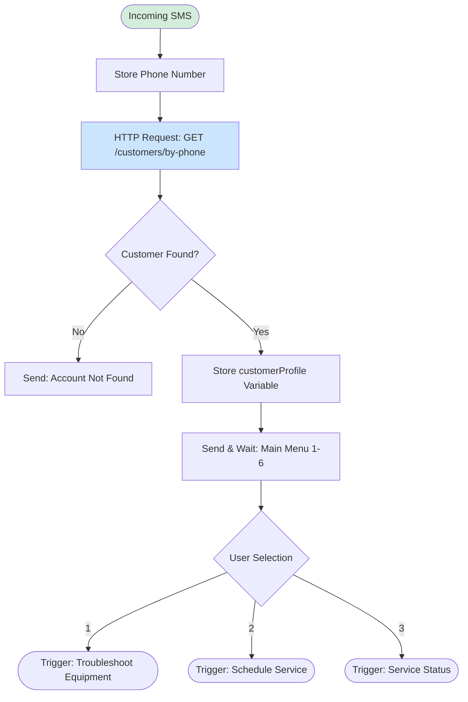

# Quick Start: View Your Diagrams RIGHT NOW

**Fastest path to seeing your flow diagrams rendered: 2 minutes**

-----

## Option 1: HTML File (FASTEST - 30 seconds)

### Steps:

1. **Download the HTML file**
   - Click this link: [Flow_Diagrams_Interactive.html](computer:///mnt/user-data/outputs/Flow_Diagrams_Interactive.html)
   - File downloads to your Downloads folder

2. **Open it**
   - Find `Flow_Diagrams_Interactive.html` in your Downloads
   - Double-click the file
   - Opens in your default browser (Chrome/Safari/Edge)

3. **View diagrams**
   - All 7 workflows displayed with beautiful flowcharts
   - Click navigation links to jump to sections
   - Scroll through to see everything

**✅ Done! You're viewing rendered diagrams.**

-----

## Option 2: Online Mermaid Editor (2 minutes)

### Steps:

1. **Go to Mermaid Live Editor**
   - Open browser
   - Go to: https://mermaid.live/

2. **Copy one diagram**
   - Download this file: [Lizzy_SMS_Complete_Flow_Diagrams.md](computer:///mnt/user-data/outputs/Lizzy_SMS_Complete_Flow_Diagrams.md)
   - Open in any text editor
   - Find a diagram (between ` ```mermaid ` and ` ``` `)
   - Copy the diagram code

3. **Paste in editor**
   - Paste in the left panel of mermaid.live
   - Diagram renders automatically on the right

4. **View/Export**
   - See rendered diagram immediately
   - Click "Actions" → "PNG" to save as image
   - Click "Actions" → "SVG" for vector graphic

**Example - Copy this code and paste it into mermaid.live:**



**✅ You'll see the Main Menu flow diagram rendered!**

-----

## Option 3: VS Code (Best for editing - 5 minutes)

### Steps:

1. **Install VS Code** (if not already installed)
   - Go to: https://code.visualstudio.com
   - Click "Download"
   - Install and open

2. **Install Mermaid Extension**
   - Click Extensions icon (left sidebar) or press `Ctrl+Shift+X`
   - Search: "Markdown Preview Mermaid Support"
   - Click "Install" on extension by Matt Bierner

3. **Open markdown file**
   - File → Open File
   - Select `Lizzy_SMS_Complete_Flow_Diagrams.md`

4. **View preview**
   - Press `Ctrl+Shift+V` (Windows) or `Cmd+Shift+V` (Mac)
   - Diagrams render in preview pane
   - Edit on left, see result on right

**✅ Now you can edit AND view diagrams!**

-----

## Which Option Should You Choose?

| Option | Best For | Time | Quality |
|--------|----------|------|---------|
| **HTML File** | Quick viewing right now | 30 sec | ⭐⭐⭐⭐⭐ |
| **Mermaid.live** | Testing one diagram | 2 min | ⭐⭐⭐⭐ |
| **VS Code** | Editing + viewing | 5 min | ⭐⭐⭐⭐⭐ |
| **GitHub** | Sharing with team | 10 min | ⭐⭐⭐⭐⭐ |

**My Recommendation:**

1. **Right now:** Use HTML file (instant gratification)
2. **For work:** Set up VS Code (best editing experience)
3. **For sharing:** Upload to GitHub (team collaboration)

-----

## Troubleshooting

### HTML File Won't Open

**Problem:** Double-clicking doesn't work

**Solution:**
1. Right-click the file
2. Select "Open with"
3. Choose your browser (Chrome, Safari, Edge)

### Mermaid.live Shows Error

**Problem:** "Syntax error" message

**Solution:**
1. Make sure you copied ONLY the mermaid code
2. Don't include the ` ```mermaid ` markers
3. Start with `graph TD` or `graph LR`

### VS Code Preview Empty

**Problem:** Preview pane shows nothing

**Solution:**
1. Make sure Mermaid extension is installed
2. Try closing and reopening VS Code
3. Make sure you pressed `Ctrl+Shift+V` (not just `Ctrl+V`)

-----

## What You'll See

### All 7 Workflows Rendered:

1. **Main Menu** - Customer entry point
2. **Troubleshoot Equipment** - Equipment selection + resources
3. **Schedule Service** - Service scheduling with async processing
4. **Service Status** - View current orders
5. **Order Parts** - Simplified parts ordering
6. **Parts Order Status** - Track parts orders
7. **View/Pay Invoice** - Invoice management

### Plus:

- System architecture diagram
- Cross-workflow context diagram
- Message templates
- Widget mapping guide
- Implementation notes

-----

## Next Steps

### After Viewing Diagrams:

1. **Read the Implementation Guide**
   - [Twilio_Studio_MVP_Implementation_Guide.md](computer:///mnt/user-data/outputs/Twilio_Studio_MVP_Implementation_Guide.md)
   - Widget-by-widget instructions

2. **Review API Requirements**
   - [Lizzy_API_Requirements_Document.md](computer:///mnt/user-data/outputs/Lizzy_API_Requirements_Document.md)
   - Send to Lizzy technical team

3. **Set up GitHub** (optional but recommended)
   - Follow: [GitHub_Setup_Guide.md](computer:///mnt/user-data/outputs/GitHub_Setup_Guide.md)
   - Share with your team

-----

## Summary

**You have 3 ways to view diagrams immediately:**

✅ **Fastest:** Download HTML file, double-click, view in browser  
✅ **Flexible:** Use mermaid.live to test individual diagrams  
✅ **Professional:** Set up VS Code for editing + viewing

**Choose the fastest option right now, then set up the others as needed.**

**🎉 Enjoy your beautifully rendered workflow diagrams!**
